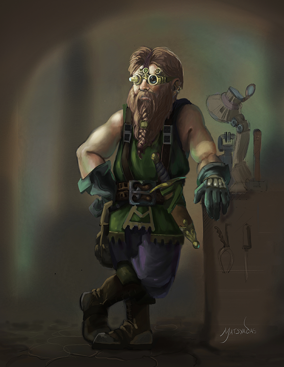

.. page:: size=11inx8.5in margin=20 watermark=background.jpg
.. section:: stack stack:columns=3 stack:equal padding=10
.. title:: hidden
.. block:: style=huge padding=6

**Ethik Beigleiter**
====================
 - Ethik Beigleiter

.. block:: style=faint strong=big

Description
 - is a **Chaotic Dwarven Adept**
 - who  **Crafts Unique Objects**
 - and is an **Initiate of the Inverted Pyramid**

.. block:: style=big strong=huge

Base Info
 - Tier: **3** -- Effort: **3**

.. block:: badge badge:shape=oval badge:tags=Pool,Edge badge:shape-style=badge
   padding=12 style=ornate strong=str

Pools
 - Might        |   | **10**    |
 - Speed        |   | **13**    | 1
 - Intellect    |   | **21**    | 2

.. title:: banner style=banner
.. block:: default style=edged emphasis=red

Recoveries -- **D6 + 3**
 - [ ] 1 action | [ ] 10 mins | [ ] 1 hour | [ ] 10 hours

Skills
 - Magic                    | **Specialized**

 - Craft: Clockwork         | Trained
 - Craft: Weapons           | Trained
 - Identification           | Trained
 - Intellect defense        | Trained
 - Mining and Shaping Tools | Trained
 - Stonecraft               | Trained

 - Axes                     | Proficient

 - Medium / Hvy weapons     | *Inability*
 - People Trust Me          | *Inability*

Special Abilities
 - **Chaotic susceptibiity**: +1 damage from mental attacks
 - **Chaotic Recovery**: On 10 hour recovery can re-roll, but GM can intrude
 - **Spell Affinity**: Every day, choose a spell to cost one less
 - **See Beyond**: I see dead people and auras *(Perception asset)*

Spells
 - I    | **Onslaught**             | Does 4 physical or 2 mental damage
 - I    | **Resonance Field**       | Defend with intellect for one minute. On a defense of 19-20 attacker takes 1 or 4 damage
 - 2I   | **Far Step**              | Leap up to long range
 - 3I   | **Clockwork Companion**   | level 3, one hour (*"Zhu Li"*)
 - 3I   | **Stasis**                | Lasts one minute
 - 3I   | **Machine Efficiency**    | For one minutes adds +2 to machine's level or allows it to ease two levels as an asset.

Artifacts and Cyphers
 - Anti-magic Lab Coat (1/20)
 - Potion of knowledege enhancement
 - `_______________________________________`
 - `_______________________________________`

Equipment
 - Bulls-eye Lantern
 - Compass
 - Fake 2-H dwarven axe and red beard
 - `_______________________________________`
 - `_______________________________________`

Misc
 - Known Passages to Dwarvenhearth (asset)
 - `_______________________________________`
 - `_______________________________________`

Advancement
 - **XP**: [X] [X] [X] [X] [] [] [] []

 - [ ] Increase Abilities -- 4 pool
 - [ ] Move to perfection -- +1 edge
 - [ ] Extra Effort
 - [ ] Skill Training
 - [ ] Other -- spell/feature

Advances Taken
 - 1: Effort, Edge, Spell (Stasis)
 - 2: **Inverted Pyramid Focus**
 - 2: Effort, Skill (Magic), Edge, Spell (Machine Companion)
 - 3: **Crafts Unique**: Specialized in *Craft Chaos Tech*,
   **Adept**: Trained in Ranged attacks doing physical damage, Extra Cipher

-----------------------------------------

default
    family=Helvetica color=#444 align=fill
edged
    borderWidth=0.5 borderColor=navy teeth=1 background=#dddde4
banner
    family=Steampunk color=white background=navy teeth=1
faint
    opacity=0.5 align=left
big
    size=18 color=navy opacity=1 font=Steamship
ornate
    size=18 color=navy font=Gotham

huge
    size=44 color=#800 font=Steamship teeth=3
str
    color=#004 bold
red
    color=#800
badge
    borderWidth=2 borderColor=#020 color=#8a8 background=#efe size=14 font=Gotham
    teeth=1

