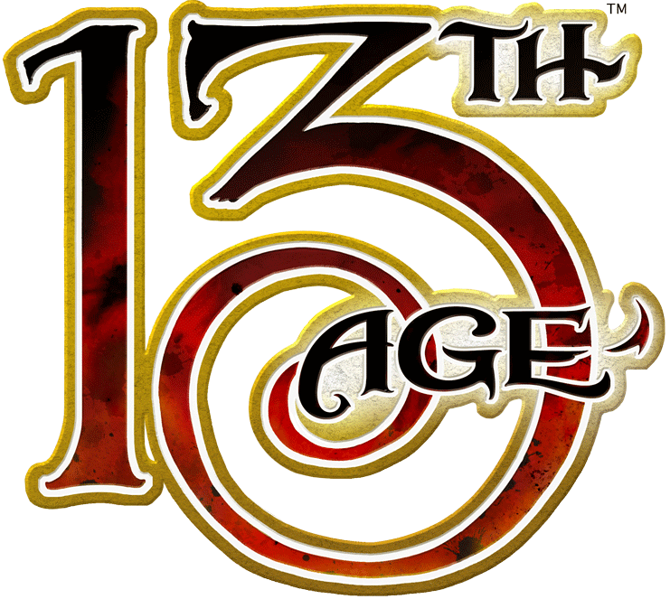
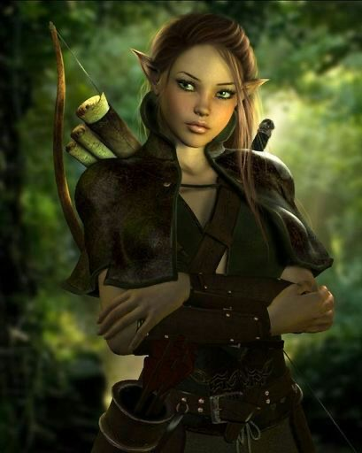
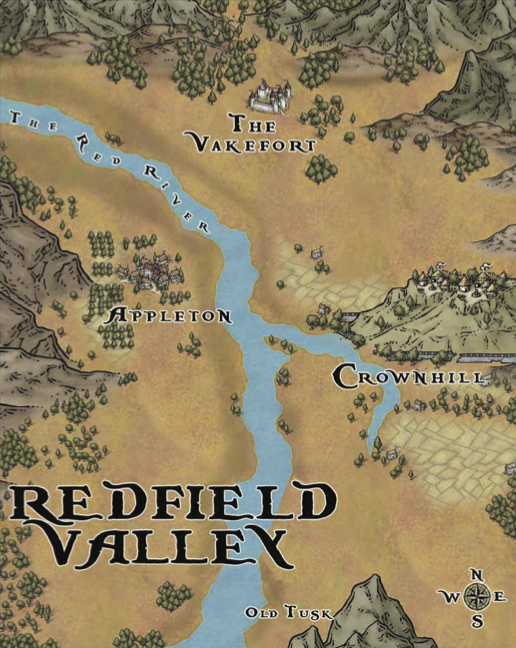

.. page:: watermark=butterflies.jpg padding=12
.. section:: stack stack:columns=3
.. title:: banner style=title
.. block:: emphasis=big

**Lunathien Calenmaethor**
==========================

.. title:: hidden

..

.. block:: style=default

- Race:**Wood Elf**     |   Class:**Druid** |   Gender:**Female**   |   Age:**62**
- *My firstborn will be the next Elf Queen*

.. block:: thermometer thermometer:rows=3 thermometer:style=therm_green emphasis=italic style=stat_style

Attributes
 - Strength     | **8**  | -1
 - Constitution | **12** | +1
 - Dexterity    | **18** | +4
 - Intelligence | **8**  | -1
 - Wisdom       | **18** | +4
 - Charisma     | **12** | +1

.. block:: thermometer thermometer:rows=3 thermometer:style=therm_red style=stat_style

Defenses
 - AC | **20**
 - PD | **15**
 - MD | **16**

---------------------------------------------------------------

.. section:: stack stack:columns=2

.. title:: banner style=heading_blue
.. block:: style=default

Level **2**         -- Initiative **+7**
 - [] ________________________
   [] ________________________
   [] ________________________

Hits: **35**                            --  Staggered: **17**
 - Recoveries: [ ][ ][ ][ ][ ][ ][ ][ ] -- **3d6+1**

---------------------------------------------------------------

.. section:: stack stack:columns=3 padding=15
.. block:: style=very_rough
.. title:: hidden

Picture

..

.. title:: banner style=heading_blue
.. block:: style=blue

Icon Relationships
 - Elf Queen  | ♡ ♡
 - High Druid | ♡

Backgrounds
 - Princess of the Elven Courts     --  3
 - Inventive Explorer               --  4
 - Madly In Love with a Stupid Guy  --  4

Druid Talents
 - **Warrior Druid Initiate**: You are trained to survive the wilds and fight in combat.
   Your AC in light armor is 12 instead of 10 like most other druids.

 - **Terrain Caster Initiate**: Access to daily spells that you can only cast in one of the
   eight specific types of terrain

 - **Shifter Initiate**: Enables you to shift your form in two ways: scout form
   transformations into quick-moving animals for out of combat reconnaissance,
   and beast form transformations into combat-ready predators.

Druid Features
 - **Nature Talking**: Everybody knows that druids can talk with plants and animals.
   It may not always work, but druids won't admit it. The DC of speaking to nature
   depends on the information you are requesting and who you are speaking with.

 - **Wilderness Survival**: You never suffer from natural weather-related cold, heat,
   or exposure. You can go longer than most people without eating or drinking,
   but only a couple days longer.

.. title:: banner style=heading_green
.. block:: style=green

Melee Basic Attack -- At-Will
 - **Standard Action**      --      **Nearby**
 - **Target**: One Creature --      **Attack**: +7 vs AC
 - **Hit**: 3d6+4 (axe)      --      **Miss**: level damage

Ranged Basic Attack -- At-Will
 - **Standard Action**      --      **Nearby**
 - **Target**: One Creature --      **Attack**: +6 vs AC
 - **Hit**: 3d6+4 (bow, axe) --      **Miss**: level damage

.. title:: banner style=heading_orange
.. block:: style=orange

Elemental Pivot -- Encounter []
 - **Flexible Attack**      --      **Trigger**: Natural 18+
 - **Effect**: During your next turn, you can cast an Elemental Mastery
   at-will feat spell of your choice once as a quick action, even if
   you don’t normally know that spell.

Shillelagh -- Encounter []
 - **Flexible Attack**      --      **Trigger**: Natural 3, 13
 - **Effect**: If the target is not staggered after attack, attack becomes a
   critial hit. Otherwise, heal with a recovery and the target is stuck until
   end of next turn

.. title:: banner style=heading_red
.. block:: style=red

Ruination (3) -- Encounter []
 - **Ranged Terrain Feat Spell**            --      **Nearby**
 - **Target**: All nearby enemies           --      **Attack**: +7 vs MD
 - **Hit**: 4d6 to all nearby enemies (once per mook group)
 - **Note**: Targets the highest MD of all nearby enemies
   (don't have to be able to see them)

Elven Grace -- Wood Elf
 - At the beginning of each of your turns, roll a d6 to see if you get an extra
   standard action. If your roll is equal or lower than the escalation die,
   you get an extra standard action. Every time you gain a standard action,
   increase the die size

.. title:: banner style=heading_black
.. block:: style=black

Terrain Spell -- Daily [] []
 - Various spells depending on the surrounding terrain; cannot use the same terrain twice.

Beast Form -- Daily []
 - **Quick action**: You leave your humanoid form behind and assume the form of a deadly
   predator such as a wolf, panther, tiger, bear, wolverine or lion.

Beast Form Attack
 - **Melee Attack**:    -- +6 vs AC
 - *Natural Even Hit*: 2d10+4
 - *Natural Odd Hit*: 2d6+4
 - *Miss*: Repeat the attack against the same or a different target.
   This has no miss effect.

Aspect of the Bear -- Daily []
 - **Quick action**: Until the end of the battle, while in beast form,
   gain +2 to attack and damage against mooks and enemies of lower level

Scout Form  -- Daily []
 - **Retrospective Action**    -- DC 15/20/25
 - Scout Form Background: **d4+1**
 - *Normal success*: Gain +4 bonus to initiative this battle.
 - *Hard success*: As a free action at some point during the battle,
   you can grant one of your allies a re-roll on an attack roll or save.
 - *Ridiculously hard success*: GM chooses between giving a re-roll
   at some point during the battle, or a floating icon
   relationship result of 6 with a random icon.

Cave, Dungeon, Underworld  -- Terrain Spells
 - **Spider Climb** -- Quick • Self -- p54
 - Climb, fight on ceilings and walls; get one attack re-roll
 - **Fungal Ambuscade** -- Attack vs PD  Ranged -- p54
 - Target takes ongoing poison

Forest, Woods  -- Terrain Spells
 - **Barkskin** -- Quick • Self/Ally -- p55
 - Target in light armor gains +3 to AC (not fire damage)
 - **Entangle** -- Attack d3 vs PD  Ranged -- p55
 - Target takes damage and may be stuck

Ice, Tundra, Snow  -- Terrain Spells
 - **Ice Shield** -- Quick • Self -- p55
 - Attacker who rolls 1-15 takes 4d6 cold
 - **Icicle** -- Attack Nearby/Far  Ranged -- p56
 - Target takes cold damage and may be hampered

Mountains  -- Terrain Spells
 - **Rumble** -- Quick • Self --   p58
 - When you end adjacent to 2+, each takes 2d6+4 thunder
 - **Stonekskin** -- Quick •  Self/Ally -- p58
 - Resist damage 16+ until two 16+ attacks hit target

Ruins  -- Terrain Spells
 - **Inevitable Collapse** -- One nearby -- p59
 - Damage and ongoing damage with special save

Swamp, Lake, river  -- Terrain Spells
 - **The Big Muddy** -- All nearby -- p60
 - Enemies with low hit points  are stuck
 - **Reclamation** -- 2 weakest • Ranged -- p58
 - Damage and cannot heal

.. title:: banner style=heading_blue
.. block:: style=blue

Leather Surcoat -- +1 Magic Armor
 - Tight-fitting tooled leather armor
 - Light armor improves AC, MD

Pearl of Wisdom -- Magic Item
 - +1 to saves when ≤ 10 hp
 - Daily: Re-roll a wisdom skill, taking better result (recharge 11)
 - Quirk: Bookworm

Misc Items
 - Potion of Healing +d8
 - Silk rope, Climbing kit, lanter, chalk
 - Sketch book, charcoal, pencils
 - Small harp

Feats
 - [X] Further backgrounding
 - [X] Terrain spell *Ruination*
 - [X] *Shillelagh* adventurer feat

---------------------------------------------------------------

.. section:: stack stack:columns=1
.. title:: hidden
.. block:: style=default

---------------------------------------------------------------

.. section:: stack stack:columns=2

..

Redfield Valley History
 - As the campaign started, you all got to know each other while adventuring in and around Redfield Valley, a bucolic area.  The valley featured two towns: on the west side of the valley was Appleton (where you spent more time), and on the east side was Crownhill.  At the north end of the valley was a fortress, the Vakefort, which guarded the entrance to the Vakevale, a wild area which was said to be full of monsters.
 - You got to know many of the residents of Redfield Valley, and you undertook several missions into the Vakevale, dealing with monsters, and gaining some treasure.
 - As you were returning to Redfield Valley, the floating city of Vantage (one of the Archmage's main cities) came crashing to earth, directly into the valley.
 - After surviving the fall of the city itself, you scrambled to help the valley's residents.  You were able to rescue a number of people in Appleton (though many are badly injured); you went across the valley to Crownhill to help them, as well, but that town was more heavily damaged, and fewer survived there.
 - The ruins of Vantage are now strewn across Redfield Valley, and many of its contents, including once-captive monsters, as well as treasures, lie in the ruins, ripe for exploration.

---------------------------------------------------------------

.. section:: stack stack:columns=1
.. title:: banner style=heading_green

Characters
 - Chris    | **Solea Orr**                     | Human Rogue            | *I am the only human in this Age to be resurrected by the Great Gold Wyrm*
 - Graham   | **Lunathien "Luna" Calenmaethor** | Wood Elf Druid         | *My firstborn will be the next Elf Queen*
 - Josh     | **Friend (Watcher of the Pit)**   | Forgeborn Demonologist | *I am the constructed container of a stolen Hellmouth; it fuels my core*
 - Suzanne  | **Lorcan Laoch**                  | Aasimar Barbarian      | *Every statue of an angel in the Dragon Empire looks exactly like me*
 - Vic      | **Degavor**                       | Tiefling Necromancer   | *I know everyone's name*
 - Wes      | **Ferran Broadwell**              | Human Ranger           | *I lost a foolish wager to a powerful dwarf warlord*

---------------------------------------------------------------

Styles
------

default
  family=Baskerville size=8 align=fill roughness=0.75 opacity=0.8
title
  size=32 color=darkGreen family=LoveYou

heading
  color=white background=black family=Gotham
heading_blue
  inherit=heading background=navy
heading_black
  inherit=heading background=black
heading_green
  inherit=heading background=green
heading_red
  inherit=heading background=red
heading_orange
  inherit=heading background=orange

stat_style
  color=white family=Helvetica size=10

very_rough
  roughness=3 opacity=1

therm_green
  inherit=heading_green roughness=0.33 opacity=1
therm_red
  inherit=heading_red roughness=0.33 opacity=1

big
  size=16 color=darkGreen family=LoveYou align=center

blue
  background=#eef
black
  background=#eee
green
  background=#efe
red
  background=#fee
orange
  background=#fec

