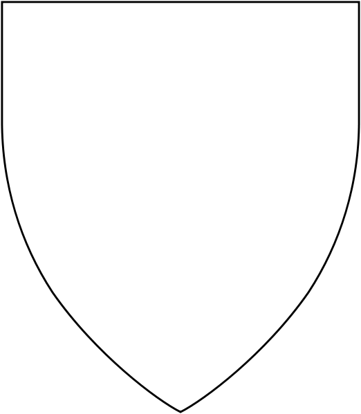

.. page:: padding=10 watermark=PendragonLogo.png
.. section:: stack stack:columns=2 padding=0
.. block:: emphasis=big
.. title:: hidden

Basic
=====

Name:
 - *[[           ]]*

Logo
====
.. image:: helmet.png
   :align: right
   :height: 40
..

---------------------------------------------------------------

.. section:: stack stack:columns=3 padding=0 stack:equal

A
=

 - Age / Birth #:       |  [[           ]] -- [[   ]]
 - Lord:         |  [[           ]]

B
=
 - Class:        |  [[           ]]
 - Homeland:     |  [[           ]]

C
=
 - Culture:      |  [[           ]]
 - Religion:     |  [[           ]]

---------------------------------------------------------------

.. section:: stack stack:columns=3 padding=10

Coat of Arms
============

..

.. title:: hidden
.. block:: thermometer thermometer:rows=5 thermometer:style=therm style=stat_style

Attributes
==========

 - SIZ | [[  ]]
 - DEX | [[  ]]
 - STR | [[  ]]
 - CON | [[  ]]
 - APP | [[  ]]

.. title:: default padding=20
.. block:: style=standard-block padding=3 emphasis=small

Glory
=====

 - Total        | [[      ]]
 - This Game    | [[    ]]

Attributes
==========

 - Weapon Damage:       | [[  ]]
 - Unconscious:         | [[  ]]
 - Movement Rate:       | [[  ]]
 - Max Hit Points:      | [[  ]]
 - Current Hits: -- [[        ]]

.. title:: default padding=20

Distinctive Features
====================

 - [[        ]]
 - [[        ]]
 - [[        ]]
 - [[        ]]

Horse
=====
 - Type     | [[      ]]
 - Damage   | [[      ]]
 - Move     -- [[  ]] -- Armor    -- [[  ]] -- HP       --  [[  ]]
 - Other    | [[      ]]
 - Other    | [[      ]]
 - Other    | [[      ]]

Armor
=====

 - [[     ]] -- [[  ]]
 - [[     ]] -- [[  ]]
 - [[     ]] -- [[  ]]
 - [[     ]] -- [[  ]]
 - Shield -- [[     ]] -- [[  ]]

Squire
======
 - Name   | [[      ]]
 - Age          | [[  ]]
 - *[O]* First Aid    | [[  ]]
 - *[O]* Battle       | [[  ]]
 - *[O]* Horsemanship | [[  ]]

Traits
======

 - *[O]* Chaste       -- [[  ]] | ✣ | [[  ]]   -- Lustful     *[O]*
 - *[O]* Energetic    -- [[  ]] | ✣ | [[  ]]   -- Lazy        *[O]*
 - *[O]* Forgiving    -- [[  ]] | ✣ | [[  ]]   -- Vengeful    *[O]*
 - *[O]* Generous     -- [[  ]] | ✣ | [[  ]]   -- Selfish     *[O]*
 - *[O]* Honest       -- [[  ]] | ✣ | [[  ]]   -- Deceitful   *[O]*
 - *[O]* Just         -- [[  ]] | ✣ | [[  ]]   -- Arbitrary   *[O]*
 - *[O]* Merciful     -- [[  ]] | ✣ | [[  ]]   -- Cruel       *[O]*
 - *[O]* Modest       -- [[  ]] | ✣ | [[  ]]   -- Proud       *[O]*
 - *[O]* Prudent      -- [[  ]] | ✣ | [[  ]]   -- Reckless    *[O]*
 - *[O]* Spiritual    -- [[  ]] | ✣ | [[  ]]   -- Worldly     *[O]*
 - *[O]* Temperate    -- [[  ]] | ✣ | [[  ]]   -- Indulgent   *[O]*
 - *[O]* Trusting     -- [[  ]] | ✣ | [[  ]]   -- Suspicious  *[O]*
 - *[O]* Valorous     -- [[  ]] | ✣ | [[  ]]   -- Cowardly    *[O]*
 - Directed: -- [[                   ]] -- [[  ]]
 - Directed: -- [[                   ]] -- [[  ]]
 - Directed: -- [[                   ]] -- [[  ]]

Passions
========

 - Honor                    | [[  ]]
 - Hospitality              | [[  ]]
 - Fealty (Lord)            | [[  ]]
 - Love (Family)            | [[  ]]
 - [[           ]]          | [[  ]]
 - [[           ]]          | [[  ]]
 - [[           ]]          | [[  ]]

Skills
======
 - *[O]* Awareness        -- [[  ]]
 - *[O]* Battle           -- [[  ]]
 - *[O]* Compose          -- [[  ]]
 - *[O]* Courtesy         -- [[  ]]
 - *[O]* Dancing          -- [[  ]]
 - *[O]* Falconry         -- [[  ]]
 - *[O]* First Aid        -- [[  ]]
 - *[O]* Flirting         -- [[  ]]
 - *[O]* Folklore         -- [[  ]]
 - *[O]* Gaming           -- [[  ]]
 - *[O]* Horsemanship     -- [[  ]]
 - *[O]* Hunting          -- [[  ]]
 - *[O]* Intrigue         -- [[  ]]
 - *[O]* Literacy         -- [[  ]]
 - *[O]* Orate            -- [[  ]]
 - *[O]* Play Instrument  -- [[  ]]
 - *[O]* Recognize        -- [[  ]]
 - *[O]* Religion         -- [[  ]]
 - *[O]* Sing             -- [[  ]]
 - *[O]* Stewardship      -- [[  ]]
 - *[O]* -- [[      ]]    -- [[  ]]
 - *[O]* -- [[      ]]    -- [[  ]]

Weapon Skills
=============
 - Charge           -- [[  ]]
 - Sword            -- [[  ]]
 - Spear            -- [[  ]]
 - Hafted           -- [[  ]]
 - 2-Handed Hafted  -- [[  ]]
 - Brawling         -- [[  ]]

.. section:: stack stack:columns=2 padding=11 stack:equal

---------------------------------------------------------------------

Annual Glory Awards
===================
 - Traits             | [[  ]]
 - Chivalry           | [[  ]]
 - Holdings           | [[  ]]
 - Passions           | [[  ]]
 - Religion           | [[  ]]
 - **Total**          | [[  ]]

Equipment At Home
=================
- Denarii -- [[        ]]
- Libra --   [[        ]]
- [[           ]]
- [[           ]]
- [[           ]]
- [[           ]]
- [[           ]]
- [[           ]]
- [[           ]]

Army
====
 - Old Knights             | [[  ]]
 - Middle-Aged Knights           | [[  ]]
 - Young Knights           | [[  ]]
 - **Total Family Knights**           | [[  ]]
 -
 - Vassal Knights           | [[  ]]
 - Other Lineage Men           | [[  ]]
 - Levy           | [[  ]]

Holdings
========
- [[           ]]
- [[           ]]
- [[           ]]
- [[           ]]
- [[           ]]
- [[           ]]
- [[           ]]
- [[           ]]
- [[           ]]
- [[           ]]
- [[           ]]
- [[           ]]
- [[           ]]
- [[           ]]
- [[           ]]

Character History
=================

- Date | Important Event | Glory | Total
- [[    ]] | [[                    ]] | [[    ]] | [[    ]]
- [[    ]] | [[                    ]] | [[    ]] | [[    ]]
- [[    ]] | [[                    ]] | [[    ]] | [[    ]]
- [[    ]] | [[                    ]] | [[    ]] | [[    ]]
- [[    ]] | [[                    ]] | [[    ]] | [[    ]]
- [[    ]] | [[                    ]] | [[    ]] | [[    ]]
- [[    ]] | [[                    ]] | [[    ]] | [[    ]]
- [[    ]] | [[                    ]] | [[    ]] | [[    ]]
- [[    ]] | [[                    ]] | [[    ]] | [[    ]]
- [[    ]] | [[                    ]] | [[    ]] | [[    ]]
- [[    ]] | [[                    ]] | [[    ]] | [[    ]]
- [[    ]] | [[                    ]] | [[    ]] | [[    ]]
- [[    ]] | [[                    ]] | [[    ]] | [[    ]]
- [[    ]] | [[                    ]] | [[    ]] | [[    ]]
- [[    ]] | [[                    ]] | [[    ]] | [[    ]]
- [[    ]] | [[                    ]] | [[    ]] | [[    ]]
- [[    ]] | [[                    ]] | [[    ]] | [[    ]]
- [[    ]] | [[                    ]] | [[    ]] | [[    ]]
- [[    ]] | [[                    ]] | [[    ]] | [[    ]]
- [[    ]] | [[                    ]] | [[    ]] | [[    ]]
- [[    ]] | [[                    ]] | [[    ]] | [[    ]]
- [[    ]] | [[                    ]] | [[    ]] | [[    ]]
- [[    ]] | [[                    ]] | [[    ]] | [[    ]]
- [[    ]] | [[                    ]] | [[    ]] | [[    ]]
- [[    ]] | [[                    ]] | [[    ]] | [[    ]]
- [[    ]] | [[                    ]] | [[    ]] | [[    ]]
- [[    ]] | [[                    ]] | [[    ]] | [[    ]]
- [[    ]] | [[                    ]] | [[    ]] | [[    ]]
- [[    ]] | [[                    ]] | [[    ]] | [[    ]]
- [[    ]] | [[                    ]] | [[    ]] | [[    ]]
- [[    ]] | [[                    ]] | [[    ]] | [[    ]]
- [[    ]] | [[                    ]] | [[    ]] | [[    ]]
- [[    ]] | [[                    ]] | [[    ]] | [[    ]]
- [[    ]] | [[                    ]] | [[    ]] | [[    ]]
- [[    ]] | [[                    ]] | [[    ]] | [[    ]]
- [[    ]] | [[                    ]] | [[    ]] | [[    ]]
- [[    ]] | [[                    ]] | [[    ]] | [[    ]]
- [[    ]] | [[                    ]] | [[    ]] | [[    ]]
- [[    ]] | [[                    ]] | [[    ]] | [[    ]]
- [[    ]] | [[                    ]] | [[    ]] | [[    ]]
- [[    ]] | [[                    ]] | [[    ]] | [[    ]]
- [[    ]] | [[                    ]] | [[    ]] | [[    ]]
- [[    ]] | [[                    ]] | [[    ]] | [[    ]]
- [[    ]] | [[                    ]] | [[    ]] | [[    ]]

========================================================================

default
    opacity=0.95 font=Times-Roman size=10 align=left roughness=0.5
default-title
    size=15 font=Medieval color=navy align=center background=#fffff0
standard-block
    background=#fffff0 border=navy
small
    size=6
big
    size=30

stat_style
  color=black size=12 roughness=0
therm
  background=#A0A0FF opacity=1 roughness=0
