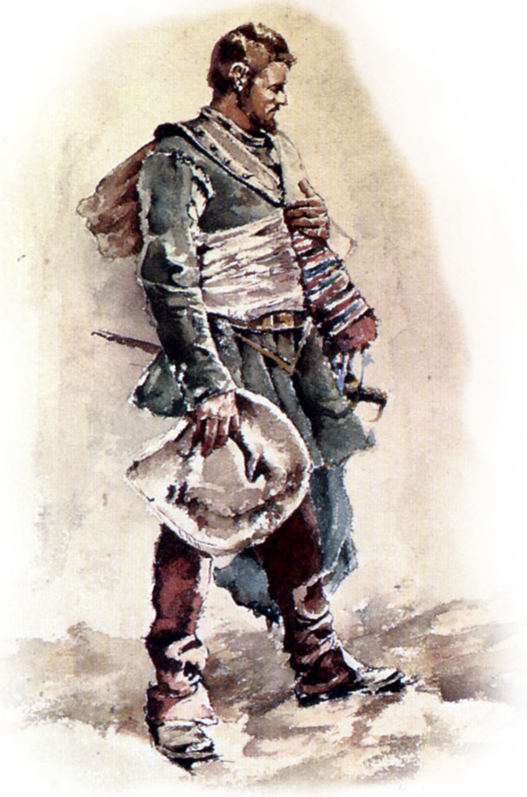

.. page:: size=5.8inx9in margin=0.66in watermark=fleur_border.png
.. section:: stack stack:columns=1 padding=0
.. title:: hidden
.. block:: style=heading padding=5 emphasis=emph strong=str

Yves deLaRouche
-------------------
 -
 -
 - Claude Gaspar Bachet de Méziriac

.. block:: style=subtitle padding=2

---------------------------------------------------------------

.. section:: stack stack:columns=1 padding=10

Stress
 - *Fate*: [ ][ ][ ] -- *Physical*:  [ ][ ] -- *Mental*: [ ][ ]
 - *Mild*:       -- [[                        ]]
 - *Medium*:     -- [[                        ]]
 - *Severe*:     -- [[                        ]]

.. block:: style=default

General
 - Chris: **Guillame** -- Wes: **Hugo** -- Jim: **Laurent** -- Suzanne: **Juliette**
 -
 - One for all and all for one! -- Intrigue in every shadow
 -
 - -- For Gallia and the Queen! --

---------------------------------------------------------------

.. section:: stack stack:columns=1 padding=12
.. block:: style=default padding=3 emphasis=emph strong=str
.. title:: default style=title

Aspects
-------

..

 - *Rocketeer* | A politically well-connected Rocketeer
 - *Trouble* | Who could resist a perfect patisserie?
 - *Swordplay* | Floats like a butterfly
 - *Family* | A religious noble house with a tradition of brewing
 - *General* | My portly figure complements my strong constitution
 - *General* | In love with Laurent's sister

Fencing
-------
 - *Appearance* | **Acrobtaic**: +1 to create advanateg with terrian/furniture
 - *Edge*       | **Impenetrable**: Increase armor value by +1
 - *Main hand*  | **Saber**: When I invoke a situation aspect about fencing style I created
   as an obstacle, increase opposition by +1.
 - *Off Hand*   | **Main Gauche**: When I succeed with style on defense,
   I may deal a 2-shift physical hit instead of gaining a boost.

Stunts
------
 - Because I am a gourmand, I gain a +2 bonus when creating an advantage using food or drink.

.. title:: hidden
.. block:: style=quote

Quote
-----
 -
 - There are four basic human needs; food, sleep, sex and revenge

---------------------------------------------------------------

Styles
------

default
    font=Baskerville
title
    font=Script size=16 align=center color=#a00
str
    color=navy bold
emph
    color=gray italic

subtitle
    font=Baskerville color=gray italic
heading
    font=Script color=#a00 size=24 align=center
quote
    font=Script color=#a44 size=14 align=center

