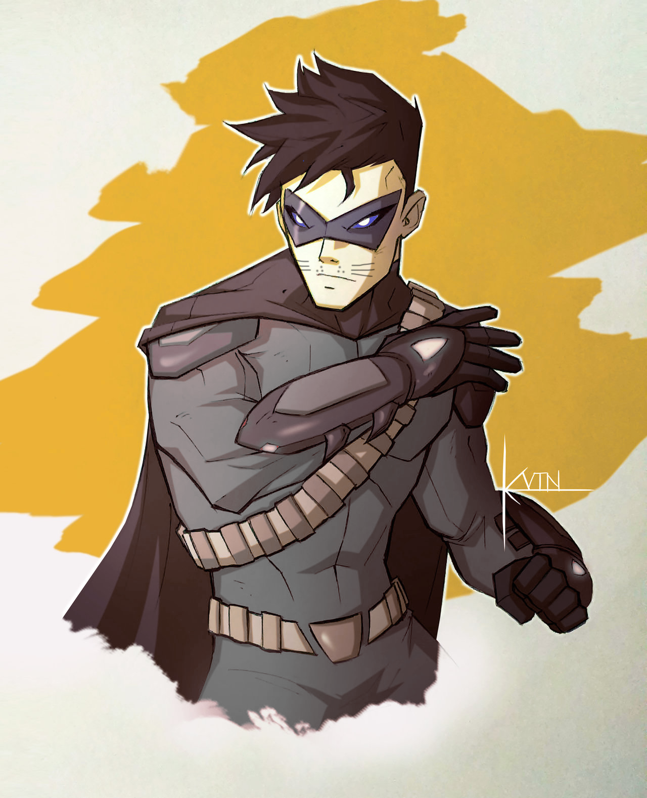

.. section: stack columns=2
.. title: hidden
.. style: title
.. block: padding=0

**Mouse**
=========

.. style: big

Qualities
 - If nobody notices me, no-one can hurt me
 - I know the city like the back of my hand
 - I can make it through this

Picture

..

---------------------------------------------------------

.. section: stack columns=2
.. title: hidden
.. style: title

**Mouse**
==========

.. style: default

Qualities
 - If nobody notices me, no-one can hurt me
 - I know the city like the back of my hand
 - I can make it through this

.. title: banner style=heading1
.. style: default

Team
 - Chris    | **Darien**
 - Graham   | **Mouse**
 - Josh     | **Warp**
 - Mike     | **Dreadnaught**
 - Suzanne  | **Ladybird**
 - Wes      | **Boo**
 - -- *"One day we will be a great team"*

Specialities
 - Stealth          -- Expert
 - Investigation    -- Basic
 - Athletics        -- Basic

.. title: hidden style=heading2

Resources
 - Stamina          | [ ][ ][ ][ ][ ][ ][ ]
 - Determination    | [ ][ ][ ]

.. title: banner style=heading2
.. style: back1

Attributes
 - **Prowess**      | poor | **2**
 - **Coordination** | good | **5**
 - **Strength**     | poor | **2**
 - **Intellect**    | average | **3**
 - **Awareness**      | good | **5**
 - **Willpower**      | good | **5**

.. title: banner style=heading1
.. style: default

Powers
 - **Telepathy** [6]: Read thoughts, resisted by will
 - **Illusion** [telepathy]: Resisted by awareness
 - **Mind Control** [5]: With mind link, cannot cause target to directly harm self or others

Notes
 - I live in the undercity and in the group apartment
 - I work at transient jobs, usually selling things (suits at the moment)

---------------------------------------------------------

Styles
------

default
  family=Gotham color=#004 size=10 align=fill
title
  size=32 color=#008 family=BackIssues align=left color=black
big
  size=16 family=BackIssues align=left

heading1
  background=#449 color=white align=left

heading2
  inherit=heading1 borderColor=#449 borderWidth=0.5

back1
  background=#def
